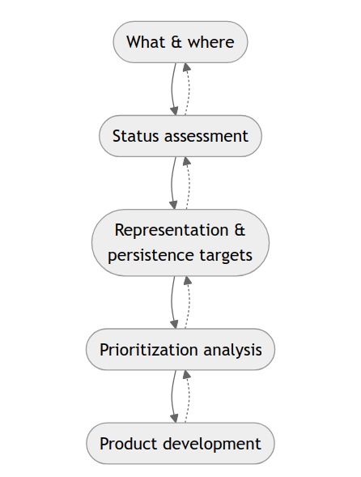
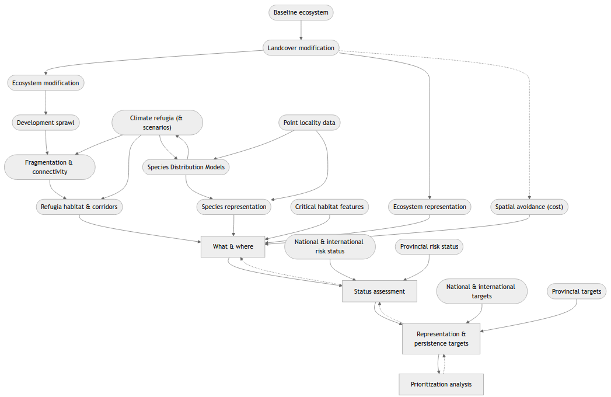

[Download Word (docx)](intro.docx){.btn .btn-secondary}

# The KwaZulu-Natal systematic conservation plan {#sec-updated-scp}

## Plan aim & stages {#sec-stages}

This terrestrial conservation plan aims to solve the problem of: how to ensure sufficient space for biodiversity conservation, in the KwaZulu-Natal terrestrial realm, whilst simultaneously minimising constraints and maximising opportunities (see @nte-cost). This is also known as the minimum set of protected areas' solution (i.e., the 'min set') [@margules2000scp; @hanson2025scp]. There are four broad stages that need to be addressed for resolution of this conservation problem [@escott2016dkn; @sanbi2024mbp] (@fig-flow_main).

::::{.column-margin}
::: {.callout-note #nte-cost title='Costs & decision support'}
Constraints and opportunities are referred as **costs** in conservation planning. These costs are more than the monetary value of acquiring protected areas for conservation efforts. In conservation planning 'costing' involves how complex socio-ecological factors are quantified and tradeoffs made. The balancing of these tradeoffs is the **'decision support'** mechanism that helps optimise the conservation planning solution *with* other human land use activities [@escott2016dkn; @sanbi2024mbp].
:::
::::

::: {#fig-flow_main}

The iterative stages, from gathering data, target setting, to prioritisation analyses, in conservation planning (c.f. @sanbi2024mbp). **(1)** The first stage addresses the what and where of biodiversity-related landscape features. **(2)** The second speaks to goal setting for the space biodiversity needs. **(3)** The third stage deals with setting up decision-making criteria that helps balance tradeoffs between the 'costs' of conservation efforts and socio-ecological factors (see @nte-cost). **(4)** Finally, the forth involves a robust and transparent analysis that solves the problem of the where and how should conservation efforts be prioritised at minimum 'cost'.
:::

The what and where of biodiversity-related features requires a collation and modelling of biodiversity occurrence data in order to provide the best possible spatial representation of biodiversity. This helps guarantee that conservation efforts are directed to the most appropriate locations. Other important what and where features for biodiversity include key habitat features for breeding, or safe zones (refugia).

The second stage concerns determination of meaningful representation and persistence targets. In other words, how much of which ecosystems and ecological features need to be represented, in the conservation plan, to secure the persistence of biodiversity. Setting up decision-support mechanisms helps us ensure that conservation efforts are focused on optimal locations. For this, other land uses and socio-ecological dynamics have to be considered [@margules2000scp; @hanson2025scp]. Once this data is gathered the final stage involves the prioritisation analysis. Multiple analyses are run showing different scenarios in a transparent process to demonstrate how the plan attempts to optimise conservation while supporting critical socio-ecological dynamics [@escott2016dkn; @sanbi2024mbp].

# Integrating biodiversity realms

Integrating the terrestrial conservation plan with the marine, estuarine, and freshwater biodiversity realms is critical for an overall *land- to sea-scape* approach. This integration ensures that critical marine realms are supported by important estuaries. These estuaries are supported by a freshwater plan, and conservation in linked terrestrial environs is prioritised to promote this overall land–ocean 'scape' ― a multi-realm *'ecoscape'* [@wedding2025bla].

::::{.column-margin}
::: {.callout-note #nte-cost title='Terrestrial and freshwater overlap'}
Wetlands provide an interesting case of overlap in the terrestrial and freshwater realms. Many species directly use both of 'realms'. The terrestrial plan accounts for this overlap through its incorporation freshwater features, that is, 'freshwater' associated species, and freshwater bodies [@escott2016dkn; @lotter2015trf]. The terrestrial plan is however specifically engineered to address terrestrial-focused conservation problems necessitating a separate exercise to address freshwater conservation planning.
:::
::::

The above linking from marine, estuary, freshwater to terrestrial, describes the hierarchical approach recommended for integrating biodiversity plans [@escott2016dkn; @lotter2015trf]. This 'linking' is done from the most dependant, that is, most affected by other adjacent realms, to the least-dependent realm. In conservation planning, the terrestrial realm is considered the least dependent, compared with the marine and estuarine realms, in KwaZulu-Natal [@escott2016dkn; @desmet2019ecb]. 

Overlap between realms has to be dealt with systematically. For conservation planning in KwaZulu-Natal, the rugged topography with incised valleys and associated catchment systems is best addressed through a catchment management approach [@escott2016dkn; @desmet2019ecb]. This catchment management system neatly ties the terrestrial to the estuarine, coastal and marine realms.

<!-- 
::: {#fig-full_flow}

::: -->
