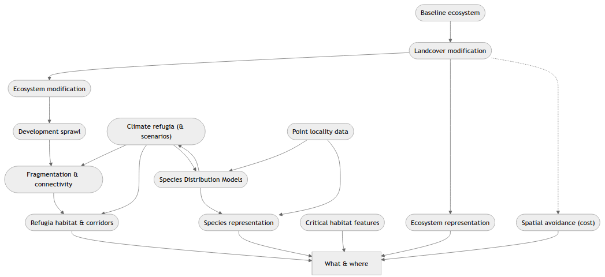

[Download Word (docx)](intro-docx.docx){.btn .btn-primary}

# The KwaZulu-Natal Systematic Conservation Plan {#sec-updated-scp}

The Systematic Conservation Plan (SCP) around these key questions [@sanbi2024mbp; @jung2025aia]:

1. What biodiversity and where is it?
2. What is the state of this biodiversity?
3. Where and how should conservation efforts be prioritised?

These questions form the basis for the structure of this conservation plan. The first key question involves collation and modelling of data in order to obtain the best available spatial representation of biodiversity. The second is largely concerned with the conservation or risk status of biodiversity that will guide the mapping of biodiversity, and the prioritisation analyses in point three. 

# Conservation plan stages {#sec-stages}

The main stages of the conservation plan are depicted in @fig-flow_main below.

::: {#fig-flow_main}


Flowchart depicting the iterative stages of gathering data, analyses, and outputs of the systematic conservation plan (c.f. @sanbi2024mbp).

:::

The stages^[These translate to the plan's objectives] of this SCP are as follows:

1. **The what and where of biodiversity — representation data** (see ATsec-eco-state):

    a. Develop a baseline‑ecosystem layer that broadly represents the spatial distribution of biotic communities (i.e., coarse‑filter features).

    a. Determine the state of ecosystems and their biodiversity:

        i. Ascertain the distribution of protected and conserved areas.
        i. Refine the baseline‑ecosystems layer to represent the current state of biodiversity.

    a. Bolster the representation of all species.^[We use “species” in the broad sense, referring to any distinct taxonomic unit (e.g., subspecies) unless otherwise indicated.]

    a. Represent ecosystem function and change — collection of additional spatial datasets.^[If available, these data can be considered for inclusion in prioritisation analysis and assessment.]

        i. Ecosystem processes  
        i. Ecosystem infrastructure  
        i. Ecosystem services  
        i. Ecological condition  
        i. Climate change information  
        i. Socio‑economic data  

1. **Determine the current state of ecosystems and their biodiversity:**

    a. Evaluate the risk and protection status of ecosystems.
    a. Align and compare provincial (and where appropriate trans‑regional) ecosystem risk status.
    a. Evaluate the risk and protection status of species.

1. **Set representation and persistence targets:**

    a. Representation and persistence of ecosystems, including alignment with the Global Biodiversity Framework [@cbd2022kmg].
    a. Representation and persistence of species.

4. **Spatial prioritisation:**

    a. Spatial framework of evaluation --- planning units.
    a. Compilation of cost (decision‑support) layers.
    a. Systematic spatial prioritisation analyses and scenario modelling.
    a. Sensitivity analysis.

5. **Product development.**

## What & where

::: {#fig-what_where}




Inputs to determining the what and where of biodiversity.

:::


# The what and where of biodiversity {#chap-ecosys-layer}

For robust representation of biodiversity and associated ecosystem infrastructure and services into the future, the what and where of biodiversity needs to consider change drivers. The functions of biodiversity, and associated ecosystems, also need to be considered for accurate representation when attempting to ensure conservation of these features.

In order to maximise representation of biodiversity in a landscape, the **SCP** process adopts a two-pronged approach, specifically:

1) a **wide-ranging** (or coarse-filter): “Ecosystem representation” approach (see [Section @sec-eco-rep]), and  
2) a **targeted** (or fine-filter): “Species representation” approach (see [Section @sec-spp-rep]) [@sanbi2024mbp].

Representation of the ecosystem types in the area-of-interest largely fulfils the **wide-ranging** component, that is, if the SCP incorporates the full diversity of ecosystems, it is likely to represent their constituent taxa. The complementary approach, that is, the **targeted** approach, caters for specific, threatened taxa, or those not operating within the parameters of represented ecosystems [@margules2000scp].

## Ecosystem representation {#sec-eco-rep}

Incorporating ecosystem types in the SCP process serves to broadly capture the spatial distribution of distinct-biological communities, and thereby the full suite of species—i.e., gamma diversity [@whittaker1960vot]—across the region of interest [@mucina2024evb]. Following the previous terrestrial SCP for KwaZulu-Natal [@escott2010cpw], a vegetation-type map formed a robust surrogate for ecosystem types. Vegetation types commonly serve as surrogates for ecosystem types because they largely capture differences in biodiversity patterns across the landscape [@sanbi2024mbp].

For an up-to-date representation of ecosystem extent, the provincial-vegetation map (i.e., coverage) had to be adjusted. The provincial-vegetation coverage serves as a representation of “natural” vegetation communities prior to **GC** pressures ca. 1750 [@mucina2018tvm]. Therefore, the coverage had to be adjusted to reflect the current state of ecosystems using the best available data.

<!-- More info to follow here as the Vegetation Map technical working group gets under way. -->

### Ecosystem and biodiversity state datasets {#sec-eco-state}

#### Protected and conserved ecosystems

#### Ecosystem protection and conservation

### Species representation {#sec-spp-rep}

#### Species selection criteria

# Criteria for the selection of species {#app-spp_crit}

## Introduction

The *broad-ranging* approach for representation of biodiversity in the SCP was complemented by a *targeted* approach (see @sec-spp-rep). The targeted approach required a systematic selection of species [@sanbi2024mbp]. Ezemvelo KZN Wildlife scientists and a broad range of stakeholders at an SCP inaugural workshop [@elliot2023bcp], developed the criteria for the inclusion of species in a workshop session with external stakeholders. For the KwaZulu-Natal SCP, these criteria were applied to each grouping of taxa as shown below.

## Criteria for inclusion

```{r}
#| tbl-cap: "Criteria for inclusion of species in the targeted approach."
#| label: tbl-spp-criteria
#| echo: false
#| 

library(knitr)
library(kableExtra)
library(flextable)

criteria <- data.frame(
  ID = 1:12,
  Criteria = c(
    "Endemic to KwaZulu-Natal.",
    "Near Endemic to KwaZulu-Natal (50–99% of taxon distribution falls within KwaZulu-Natal).",
    "Threat status (CR, EN, Rare, VU, NT). Global or Regional. Highest threat status taken.",
    "International obligation.",
    "Umbrella species.",
    "Isolated from core known range with genetic differences.",
    "Edge of range species (may be well protected in KZN but globally/regionally threatened).",
    "Life‑history stage essential for protection of species.",
    "Species conservation plan or biodiversity management plan.",
    "Other (specify).",
    "Resource use threat.",
    "Specific populations (e.g., Tembe elephants, berg eland)."
  ),
  Rules = c(
    "Feature must be triggered by ≥1 criterion; criteria equal weighting; may include uncertain data but removed if insufficient; consider age and accuracy of data.",
    rep("", 11)
  )
)
# knitr::kable(criteria) # this is supposed to render for word whilst the kable_styling will not
tbl <- flextable(criteria) |> autofit()
tbl <- color(x = tbl, color = "#2e2828")
tbl

# kable(criteria
#       , label = "tbl-spp-criteria"
# 	) %>%
#   kable_styling(full_width = FALSE, bootstrap_options = c("striped","hover"))
```

## Taxon‑specific species selection

Following the criteria in @tbl-spp-criteria, species were selected for groupings of taxa: amphibians, aquatic species, birds, invertebrates, mammals, and plants.

### Amphibians *(championed by A. Armstrong)*

All endemic, near-endemic, and threatened (CR, EN, VU) species were included.

### Aquatic species *(championed by S. Khubheka)*

### Birds *(championed by B. Coverdale)*

### Invertebrates *(championed by A. Armstrong)*

All endemic, near-endemic and threatened (CR, EN, VU) taxa are included. Only taxa in the Biodiversity Database are included in the analysis.

### Mammals *(championed by B. Coverdale)*

### Plants *(championed by C. Carbutt)*

The targeted plant species list for the updated KZN SCP revision was developed as follows:

1. An extract of the plant list used for the previous SCP by @escott2010cpw was made.
1. The extract was evaluated by the plant group (Ezemvelo KZN Wildlife + SANBI) at the C‑Plan workshop at Didima, Jan 2025.
1. The list was further refined and checked.
1. Species names were updated for taxonomic changes.
1. Red List status updated to SANBI RL version 2024.
1. The list was tabled at the July 2025 C‑Plan Steering Committee meeting.
1. Approved pending minor revision.
1. Fully revised in Aug 2025 per Steering Committee directives.
1. ~23 taxa were the focus: extinct or widespread non‑endemic taxa removed; endemic/near‑endemic or declining taxa retained.
1. Final revised list (Aug 2025) was uploaded to MS Teams as directed.

### Reptiles *(championed by A. Armstrong)*

All endemic, near-endemic and threatened (CR, EN, VU) species are included.

# Status assessment

# Representation & persistence targets

# Prioritisation analysis

# Product development

::: {#fig-full_flow}


:::
